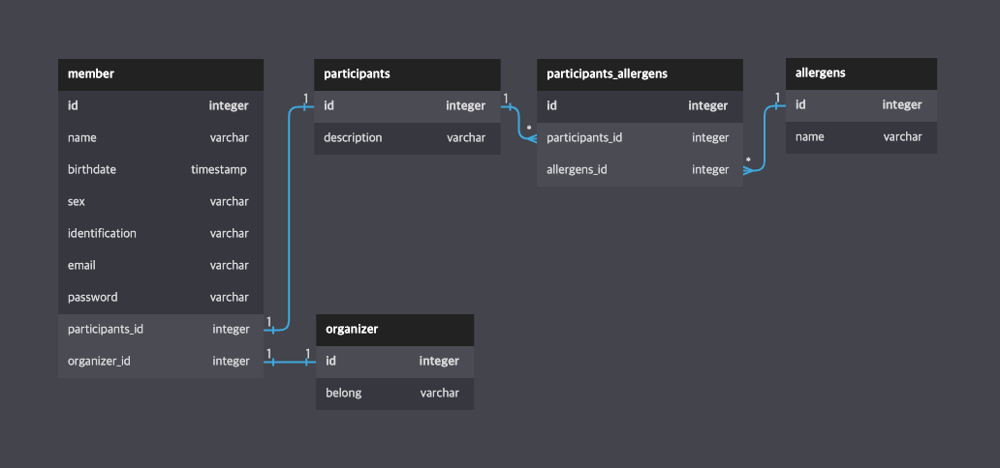

# youth-week6

### DB Schema

- member : 사용자 정보 
- organizer : 주최자 정보 
- participants : 참석자 정보 
  - participants_allergens & allergens : 알레르기 유발 물질 정보 및, 참석자 별 알레르기 유발 내역

---

### 요구사항
1. 회원가입
   - 회원가입을 할수 있어야 한다.
   - 회원가입할때 주최자 / 참석자 중 하나를 선택해야 하며, 각 선택 별 추가 정보를 받는다 
   - 비밀번호 정책을 둔다. (자유)
2. 회원 정보 변경 (Authentication Required)
   - 등록한 정보를 변경할 수 있어야 한다.
3. 내 정보 조회 (Authentication Required)
   - 내가 등록한 정보를 조회할 수 있어야 한다. 
   - 내가 설정한 추가정보 (주최자 or 참석자) 또한 조회할 수 있어야 한다.
4. 회원의 주최자 / 참석자 권한 신청 (Authentication Required)
   - 회원은 주최자로 회원가입을 하더라도, 참석자의 권한을 신청할 수 있다. 
   - 회원은 참석자로 회원가입을 하더라도, 주최자의 권한을 신청할 수 있다. 
   - 단, 각 주최자 / 참석자 권한에 대해서 추가 정보를 받아야 한다.

---

### URI 설계 
1. /members
   - Description : 회원 정보 조회 
   - Method : GET 
   - Header : jwt token 
   - Response : MemberDetailResponseDto, 200(Ok)
     - 비밀번호를 제외한 사용자 정보
     - 참석자 정보 (Optional)
     - 주최자 정보 (Optional)
2. /members 
   - Description : 회원 가입 
   - Method : POST
   - Header : jwt token
   - Request 
     - MemberJoinRequestDto
       - 회원가입에 필요한 정보 
       - 주최자 or 참석자 에 필요한 정보
   - Response : 201(Created)
3. /members
   - Description : 회원정보 업데이트, 주최자 / 참석자 권한 추가는 불가능
   - Method : PATCH
   - Header : jwt token
   - Request
     - MemberUpdateRequestDto
       - 회원수정에 필요한 정보 
       - 주최자 or 참석자 정보 수정에 필요한 정보
4. /members/organizer
   - Description : 참여자 회원의 주최자 권한 추가 
   - Method : POST
   - Header : jwt token 
   - Request
     - OrganizerJoinRequestDto
       - 주최자에 필요한 정보 
5. /members/participants
   - Description : 주최자 회원의 참여자 권한 추가 
   - Method : Post
   - Header : jwt token 
   - Request
     - ParticipantsJoinRequestDto
       - 참여자에 필요한 정보 

---